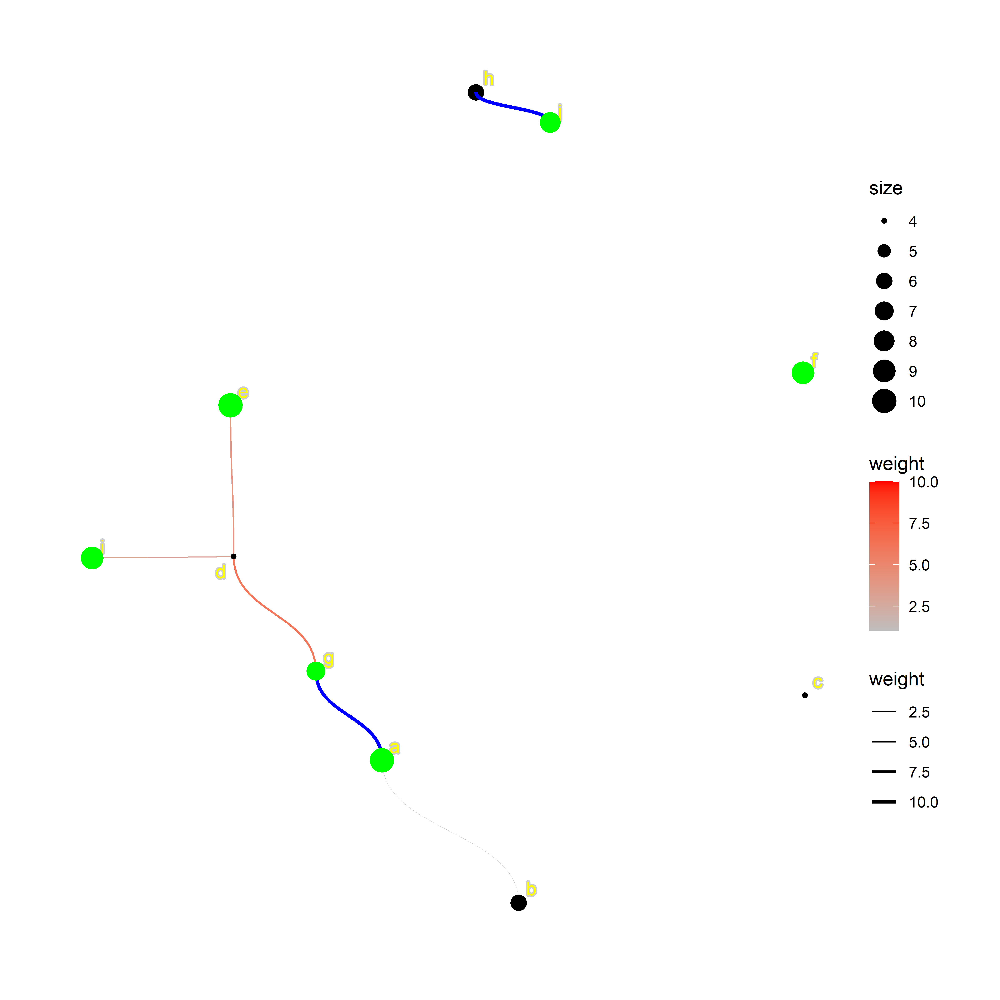
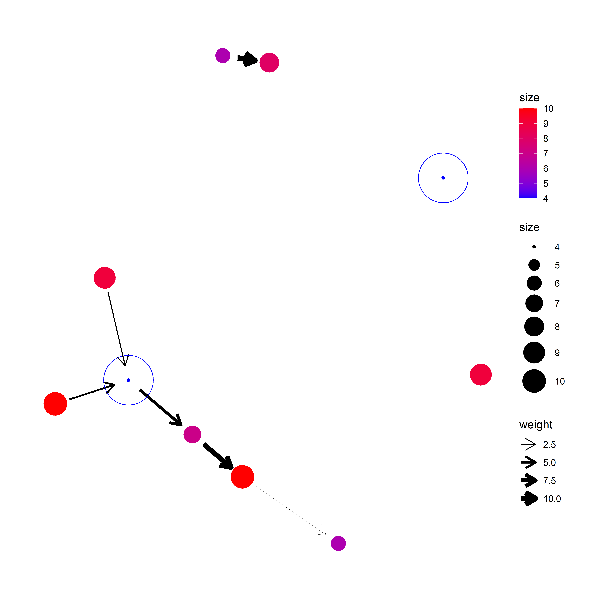

<!-- README.md is generated from README.Rmd. Please edit that file -->

# graphhighlight

This package highlights nodes and edges of `ggraph` plot.

``` r
library(ggraph)
library(igraph)
library(graphhighlight)
set.seed(1)
g <- random.graph.game(10,0.1,directed=TRUE)
E(g)$weight <- sample(1:10, length(E(g)), replace=TRUE)
V(g)$size <- sample(1:10, length(V(g)), replace=TRUE)
V(g)$name <- letters[1:length(V(g))]

ggraph(g, layout="nicely")+
  geom_edge_diagonal(aes(width=.data$weight,
                         color=.data$weight))+
  geom_node_point(aes(size=size))+
  geom_node_text(aes(label=name), repel=TRUE, color="yellow", bg.colour="grey80")+
  scale_edge_color_gradient(low="grey",high="red")+
  scale_edge_width(range=c(0.1,1))+
  highlight_edge(filter="weight>8",highlight_color = "blue")+
  highlight_node(filter="size>6",highlight_color = "green")+
  theme_graph()
```



``` r
ggraph(g, layout="nicely")+
  geom_edge_diagonal(aes(width=.data$weight,
                         color=.data$weight))+
  geom_node_point(aes(size=size))+
  geom_node_text(aes(label=name), repel=TRUE)+
  scale_edge_color_gradient(low="blue",high="red")+
  highlight_node(node_name="a")+
  highlight_edge(filter="weight<5",
                 glow=TRUE,
                 glow_base_size=TRUE,
                 glow_edge_size=0.8)+
  theme_graph()
```


``` r
ggraph(g, layout="nicely")+
  geom_node_point(aes(size=size, color=size))+
  scale_size(range=c(1,10))+
  scale_color_gradient(low="blue",high="red")+
  scale_edge_width(range=c(0,2.5))+
  geom_edge_link(aes(width=.data$weight),
                arrow = arrow(length = unit(4, 'mm')), 
                end_cap = circle(5, 'mm'),
                start_cap = circle(5, "mm"))+
  highlight_node(filter="size<5",
                 highlight_by_shape = TRUE,
                 specify_shape=21,
                 specify_shape_size=21)+
  theme_graph()
```


