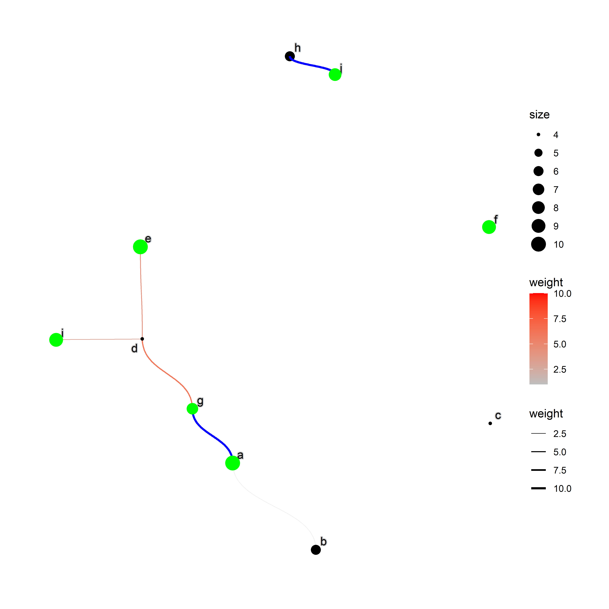

<!-- README.md is generated from README.Rmd. Please edit that file -->

# graphhighlight

This package highlights nodes and edges of `ggraph` plot.

## Installation

``` r
devtools::install_github("noriakis/graphhighlight")
```

## Usage

The detailed usage can be found in [the pkgdown
documentation](https://noriakis.github.io/software/graphhighlight).

``` r
library(ggraph)
library(igraph)
library(graphhighlight)
set.seed(1)
g <- random.graph.game(10,0.1,directed=TRUE)
E(g)$weight <- sample(1:10, length(E(g)), replace=TRUE)
V(g)$size <- sample(1:10, length(V(g)), replace=TRUE)
V(g)$name <- letters[1:length(V(g))]

ggraph(g, layout="nicely")+
  geom_edge_diagonal(aes(width=.data$weight,
                         color=.data$weight))+
  geom_node_point(aes(size=size))+
  geom_node_text(aes(label=name), repel=TRUE, bg.colour="grey80")+
  scale_edge_color_gradient(low="grey",high="red")+
  scale_edge_width(range=c(0.1,1))+
  highlight_edge(filter="weight>8",highlight_color = "blue")+
  highlight_node(filter="size>6",highlight_color = "green")+
  theme_graph()
```


